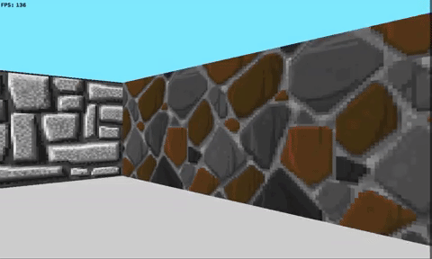

# Wolf3D @ 42

A Wolfeinstein-like renderer made in C using minilibX, with textures, basic
lighting and basic map files.

## Compiling
Run `make` and you're set. Runs on Mac OS X and Linux (with XServer).

## Running
Run `./wolf3d [map_file]`, a window should appear. You can navigate through the
map using the arrow keys. Exit by closing the window or pressing ESC.

## Map file format
It's a very simple format. Open a file in your favorite text editor, make sure
you have a grid of integers (each one being it's block ID), and it should work
right out of the box. Spawn position is the 'P' on the map.

```
1 1 1 1 1
1 0 P 0 1
1 0 0 0 1
1 1 1 1 1
```
## Preview:
 
